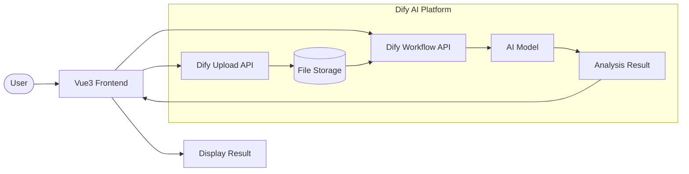
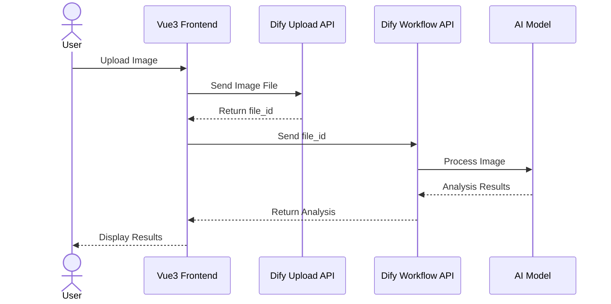
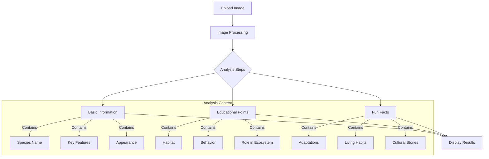

# VisionPaws.ai

🦁 An intelligent animal recognition system powered by Dify AI and Vue 3.

## System Architecture



## Image Recognition Flow



## Data Analysis Flow



## Features

- Instant animal image recognition
- Detailed species analysis
- Educational insights
- Cultural and behavioral information

## Tech Stack

- Vue 3
- PrimeVue
- Dify AI API
- Vite

## Getting Started

1. Clone the repository
2. Install dependencies: `npm install`
3. Set up environment variables
4. Run development server: `npm run dev`

## Environment Variables

```env
VITE_DIFY_API_KEY=your-api-key
VITE_DIFY_UPLOAD_ENDPOINT=your-upload-endpoint
VITE_DIFY_WORKFLOW_ENDPOINT=your-workflow-endpoint
```
